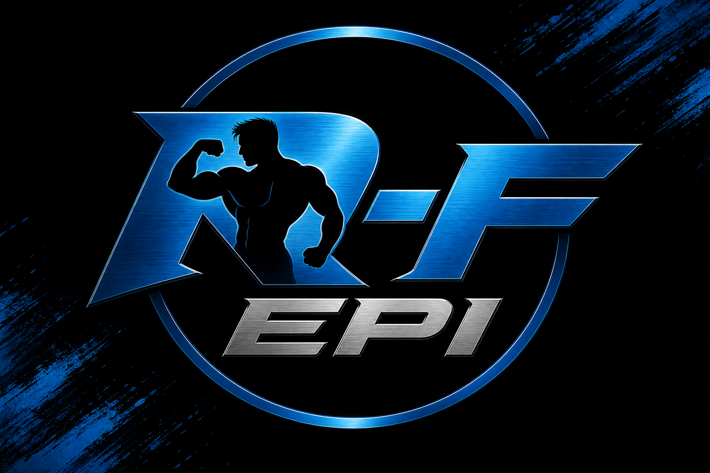

# RepFi

**Earn crypto for verified physical effort.** Live workouts · AI pose tracking · Solana payouts.

| | |
|---|---|
| **Website** | [repfi.stream](https://repfi.stream) |
| **Project X** | [@Repfitnes](https://x.com/Repfitnes) |
| **Founder** | [@0pusdev](https://x.com/0pusdev) (Opus Dev) |
| **This repo** | Public docs & transparency (no app source) |
| **Private code** | `repfistreamdev/repfi` |

  

---

## What is RepFi?

RepFi is a **fitness bounty platform**. Athletes go live, perform verified push-ups, and earn **$0.01 per verified rep**. Payouts come from a transparent donation pool funded by supporters and **$RepFi** trading fees on Solana.

- No payment required to earn
- AI verifies every rep (not self-reported)
- You paste your **public** Solana address — we never ask for private keys
- Pool balance is public at [repfi.stream/pool](https://repfi.stream/pool)

---

## Documentation

| Doc | What it covers |
|-----|----------------|
| [PROJECT.md](docs/PROJECT.md) | Full overview A → Z |
| [HOW_IT_WORKS.md](docs/HOW_IT_WORKS.md) | Registration → live → payout flow |
| [LEADERBOARD.md](docs/LEADERBOARD.md) | Rankings & public athlete profiles |
| [ANTI_CHEAT.md](docs/ANTI_CHEAT.md) | How pose AI blocks fake reps |
| [SECURITY.md](docs/SECURITY.md) | Auth, sessions, what we never store |
| [WHY_NOT_A_SCAM.md](docs/WHY_NOT_A_SCAM.md) | Trust & honest risks |
| [TOKENOMICS.md](docs/TOKENOMICS.md) | Pool, $RepFi, fee routing |
| [ARCHITECTURE.md](docs/ARCHITECTURE.md) | System design (no secrets) |
| [ROADMAP.md](docs/ROADMAP.md) | Shipped & planned |

---

## Repositories

| Repo | Access | Contents |
|------|--------|----------|
| [repfi-public](https://github.com/repfistreamdev/repfi-public) | **Public** | This documentation |
| [repfi](https://github.com/repfistreamdev/repfi) | **Private** | Application source |

Application logic, API routes, and deployment config are **not published**. This prevents attackers from mapping payout endpoints or bypassing server checks.

---

## Quick facts

| | |
|---|---|
| Rate | $0.01 / verified rep |
| Min withdrawal | $1.00 |
| Task | Push-ups (more coming) |
| Verification | MediaPipe Pose (browser) |
| Rooms | 10 live rooms |
| Leaderboard | [repfi.stream/leaderboard](https://repfi.stream/leaderboard) |
| Chain | Solana |
| Token | $RepFi on pump.fun |

---

## Contact

- Project: [@Repfitnes](https://x.com/Repfitnes)
- Founder: [@0pusdev](https://x.com/0pusdev)

---

MIT License — documentation & banner image in this repository.
